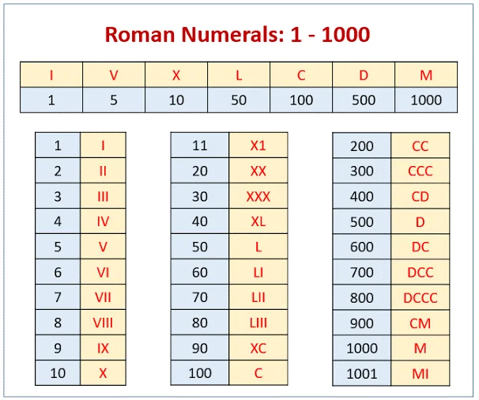

# Converting arabic number into roman numbers  &nbsp;

 
     
<h5 style="text-align: center;">Conversion table</h5>  

&nbsp;

### This exercise consist on developing an algorithm capable of doing this conversion. More explanation at code.
